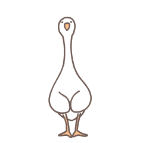

   

### :woman_technologist: About Me :
I am a Python Developer  from Moscow.

- :books: I’m currently studying Python Development in Yandex Practicum.

- :dna: I created a website using Django from the ground up. + database creation, organize URL paths, and design simple interface.

- :coffee: In my free time, I draw, play video games, go to gym and read tech articles.

- :mailbox: How to reach me: 

 

### :hammer_and_wrench: Languages and Tools :

  &nbsp;
  &nbsp;
  &nbsp;
  &nbsp;
  &nbsp;
  &nbsp;
  &nbsp;
  &nbsp;
  &nbsp;
  

**Python, Django REST Framework, REST API, PostgreSQL, Docker, Docker-compose, Yandex.Cloud, HTML, CSS, git, pytest, unittest, venv, API, json, Linux, nginx, etc.**

### :fire: My Stats :

